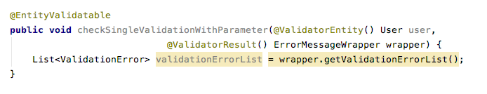

# README for Entity Validator

## Entity Validator :

Helps you to validate your entity with out writing any code inside 
you application. 
Also you can customise your validation messages. 

[src_folder]: src/main/java/techcr/utility/entityvalidator

### Validator Types. 
- All the available validator types listed under [Validators](src/main/java/techcr/utility/entityvalidator/type/notation).
- Example Code to apply validators : [FieldTest](src/test/java/techcr/utility/entityvalidator/entity/FieldTest.java)
- Library allow you to write custom exception : 
    - Field should annotate with [CustomValidate](src/main/java/techcr/utility/entityvalidator/type/notation/CustomValidate.java)
    - Should provide implementation of [CustomFieldValidator](src/main/java/techcr/utility/entityvalidator/process/CustomFieldValidator.java)

### Execute validation.
[Validation Execution example](resource/Validator_execution_example.png)

[EntityValidatable]: src/main/java/techcr/utility/entityvalidator/config/EntityValidatable.java 
[EntityValidationErrorHandler]: src/main/java/techcr/utility/entityvalidator/config/EntityValidationErrorHandler.java
[ValidatorEntity]: src/main/java/techcr/utility/entityvalidator/config/ValidatorEntity.java
[ErrorMessageWrapper]: src/main/java/techcr/utility/entityvalidator/config/ErrorMessageWrapper.java
[ValidatorResult]: src/main/java/techcr/utility/entityvalidator/config/ValidatorResult.java
[ErrorMessageStorage]: src/main/java/techcr/utility/entityvalidator/config/ErrorMessageStorage.java


## Spring AOP Configuration: 

### Import Aspect to Spring Context. 
- [Configure in xml](resource/XMl_configeration.png) 
- [By Creating Bean](resource/Imprt_As_Bean.png) 

### Validation Configuration
- Annotate validation needed method with [EntityValidatable]
    - enableStorage - Default false. by enabling this, can retrieve errors from [ErrorMessageStorage](README.md#as-parameter)
    - errorHandler 
        - Can provide implementation of [EntityValidationErrorHandler].
        - Error message Can retrieve as [Custom Error Handler](README.md#as-custom-error-handler) 
- Annotate validation entity parameter with [ValidatorResult]

### Error Retrieve

#### As parameter
- Add [ErrorMessageWrapper] as parameter. 
- Annotate parameter with [ValidatorResult]
- Library will populate error messages if exists. 
- [Single Parameter Example Code](resource/Single_Error_retrieve_as_parameter.png) 
- [Multiple Parameter Example Code](resource/Multiple_error_retrive_as_parameter.png) 

#### From Error Message storage
- Enable Storage to TRUE, Ex: @EntityValidatable(enableStorage = true)
- Can retrieve errors from [ErrorMessageStorage] Ex : ErrorMessageStorage.getErrorMessages();
- [Single Parameter Example Code](resource/Single_Error_retrive_from_storage.png) 
- [Multiple Parameter Example Code](resource/Multiple_Error_retrive_from_storage.png) 

#### As Custom Error Handler
- Provide implementation of [EntityValidationErrorHandler] through EntityValidatable annotation. 

### ii8 Support
```bash
Entity Validator support message resolver. 
through dependant application, can provide MessageResolver which wrap Locale resolver
```
[MessageResolver](src/main/java/shipxpress/utility/entityvalidator/config/MessageResolver.java)

It supports for both 
- FieldName
- ErrorDescription

Annotation Values should start with **KEY::**

Ex: @Mandatory(errorDesc = "KEY::MANDATORY")

```bash
MessageResolver can configure via ValidatorUtil. 
ValidatorUtil#configureResolver method
Ex: ValidatorUtil.configureResolver(String::toUpperCase);
```
